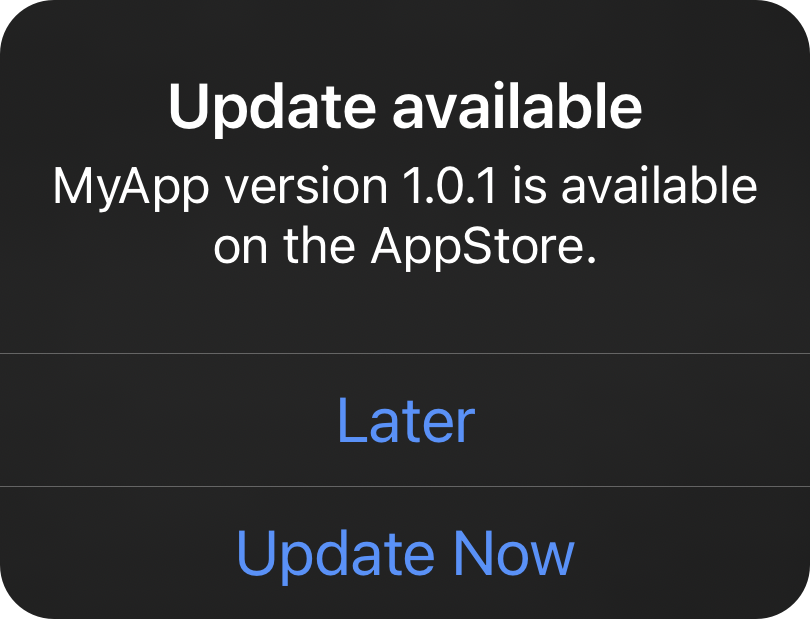
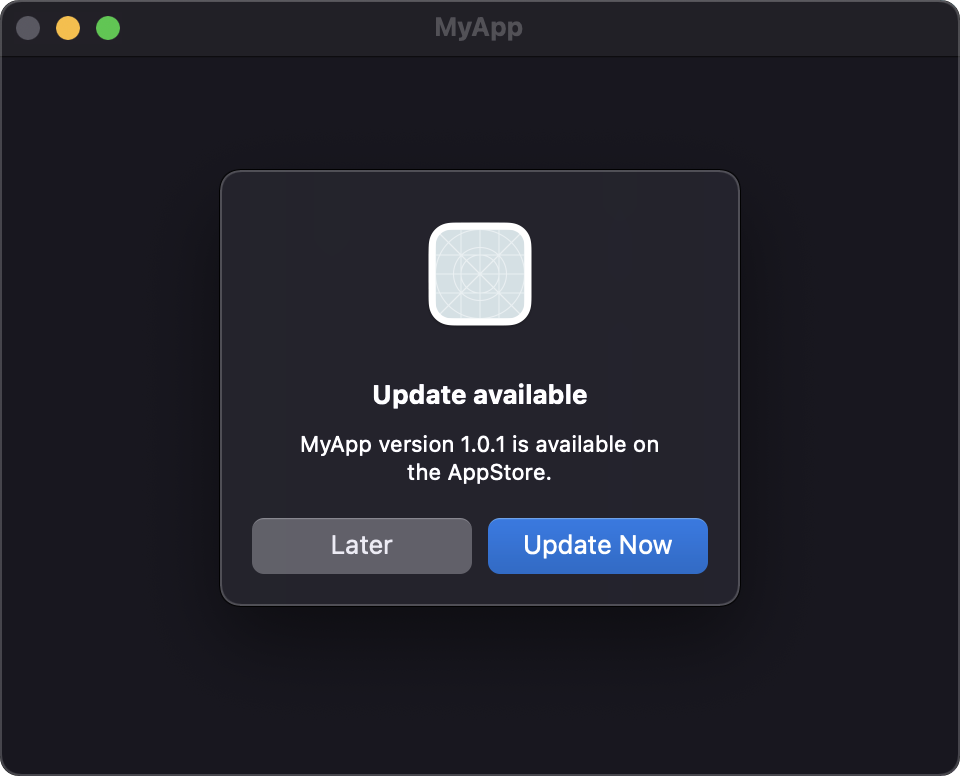

[](https://github.com/apple/swift)
[](https://github.com/sentryco/UpgradeAlert/actions/workflows/Tests.yml)
[](https://codebeat.co/projects/github-com-sentryco-upgradealert-main)

# 🔔 UpgradeAlert

> Easy update notifications.

## Table of Contents
- [Example](#example)
- [Screenshots](#screenshots)
- [Why?](#why)
- [How](#how)
- [Todo](#todo)
- [License](#license)

### Example:
```swift
import UpgradeAlert

guard Bundle.isBeta else { print("App is beta or simulator, skip checking for update"); return }

UpgradeAlert.config = UAConfig( // Configure the alert
   isRequired: false, // Require users to update
   alertTitle: "👋 A new version of (your app)'s on the App Store!", // alert title
   alertMessage: { version, appName in
      "Please update now, so you can get the latest bug fixes and features."
   }, // Alert message
   laterButtonTitle: "Later", // Skip update button title
   updateButtonTitle: "Update Now" // Go to App Store
)
        
UpgradeAlert.checkForUpdates { outcome in // Check Apple endpoint for updates
   if case .error(let err) = outcome {
      print("Err: \(err.localizedDescription)")
   } else { // Opportunity to track user action here with GA etc
      print("Outcome: \(String(describing: outcome))") // notNow, notNeeded, appStoreOpened
   }
}
```
**For debugging**

```swift
// Show a test alert, to make sure everything looks good.
UpgradeAlert.showAlert(appInfo: .init(version: "1.0.1", trackViewUrl: "https://apps.apple.com/app/id/com.MyCompany.MyApp"))
```

> **Warnings**  
> Setting `isRequired = true` bricks the app until it's updated
> For macOS `applicationDidBecomeActive` will be called after dismissing the UpgradeAlert, make sure you init UpgradeAlert from another method or else it will create an inescapable loop. This does not apply for iOS.

### Screenshots:

**iOS:**

  

**macOS:**



### Why?
- 🖥 macOS doesn't auto-update apps by default.
- 📲 iOS auto-updates apps by default, but a users might have turn auto-updates off.
- 🕸 Users might be on older OSes no longer supported by your app, in which case you'd need to "soft-brick" the app.
- 🪦 No more supporting 6+ month old app versions in your backend
- 🥶 Supporting multiple versions of your app results in bloated app code that is hard to iterate on
- 🤬 Users will stop complaining about issues that have already been fixed in the last update
- 🥵 Users will stop giving bad reviews because of errors with old software
- 🔥 Avoid crashes by staying compatible with the latest device API changes and platform updates
- 🚨 Getting urgent security updates out to as many users as possible as quickly as possible

### How:
- UpgradeAlert checks the App Store for updates, and shows an alert when one's available (as seen below).
- You can pick between an alert that notifies users of updates and allows dismissal, and an alert that requires the user to update, and "soft-bricks" the app until it's updated.
- Alert titles, messages, and button labels are completely customizable.

### TODO:
- Add screenshot from a test app? ✅
- Add support for SwiftUI ✅
- Add support for TestFlight (There's a repo in Issues with a link to another repo that recently added support for this). 
- Add country-code to json. en -> english etc. (later)
- Add localization support
- Add support for: SKStoreProductViewController allowing the update to be initiated in-app. see https://github.com/rwbutler/Updates/ for code
- Maybe add 1 day delay to showing update alert: to avoid an issue where Apple updates the JSON faster than the app binary propogates to the App Store. https://github.com/amebalabs/AppVersion/blob/master/AppVersion/Source/%20Extensions/Date%2BAppVersion.swift
- Doc params
- Clean up comments

## License
This project is licensed under the terms of the MIT license. See the [LICENSE](LICENSE) file.
